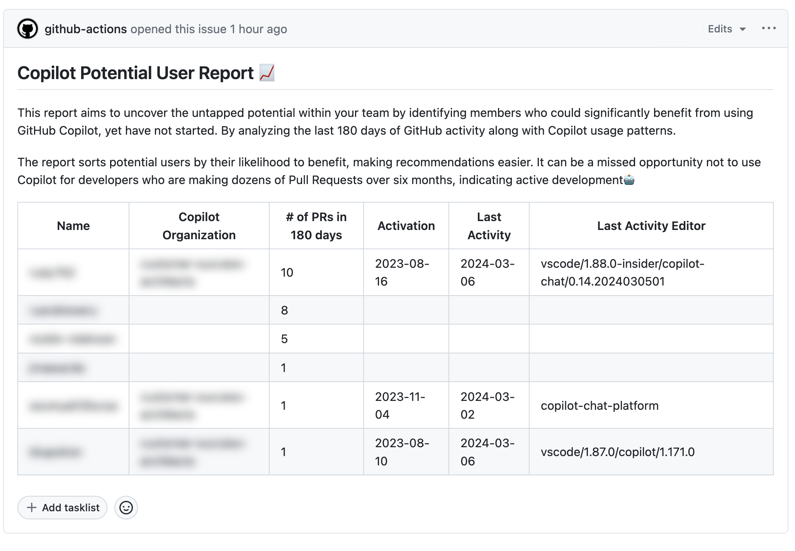
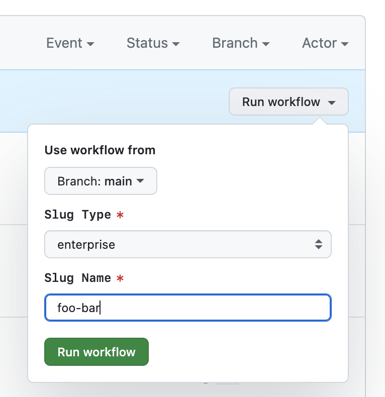

# Copilot Potential User Report Action

This GitHub Action is designed to uncover the untapped potential within your team by identifying members who could significantly benefit from using GitHub Copilot, yet haven't started. By analyzing the last 180 days of GitHub activity along with Copilot usage patterns, this tool aims to enhance your team's productivity by integrating AI pair programming more comprehensively.

**🚀 Features**

- **Insightful Analysis**: Generates reports based on Pull Request activities and Copilot usage data, sourced from the audit log and Copilot billing API.
- **Targeted Recommendations**: Sorts potential users by their likelihood to benefit, making recommendations easier. It's a missed opportunity not to use Copilot for developers who are making dozens of Pull Requests over six months, indicating active development!
- **Easy Integration**: As the flexible GitHub action, you can set up scheduled or manual executions, integrate with your other repositories, and even automate issue creation, among other possibilities.

**📈 Report Contents**

- **Pull Request Count**: Number of PRs created by the user within the specified period.
- **Copilot License Status**: Information on whether the user has been granted Copilot access by their organization.
- **Recent Copilot Usage**: Latest data on the user's interaction with Copilot.



## 🚀 Getting Started

To begin utilizing the `yuhattor/copilot-potential-user-report-action` action in your workflow, follow the steps outlined below. This action allows you to generate insightful reports on Copilot usage trends against GitHub activity, making it an invaluable tool for enhancing developer experience.

**Weekly Issue Report:**

Most straightforward way to use this action is to create a weekly issue report. This will help you to keep track of the potential Copilot users in your organization or enterprise.

```yml
name: "Weekly Issue Report: Copilot Potential User"

on:
  schedule:
    - cron: "0 0 * * 1"

jobs:
  Report:
    runs-on: ubuntu-latest
    steps:
      - name: Generate Copilot Potential User Report
        uses: yuhattor/copilot-potential-user-report-action@v0.1
        id: report
        with:
          pat: ${{ secrets.PAT }}
          slug_type: <<enterprise or organization>>
          slug_name: <<your enterprise or organization name>>
      - run: gh issue create --title "Copilot Usage Report" --body "${{ env.SUMMARY}}" --repo $GITHUB_REPOSITORY
        env:
          GH_TOKEN: ${{ secrets.GITHUB_TOKEN }}
          SUMMARY: ${{ steps.report.outputs.summary }} 
```

If you want to create an issue with the report, you need to add the following permissions to the GitHub Actions workflow permissions: `Read and write permissions`

**Workflow Dispatch (Action Summary):**

You can also use the `workflow_dispatch` event to manually trigger the action and generate a report. This is useful if you want to generate a report on demand.

```yml
name: "Manual Report: Copilot Potential User"

on:
  workflow_dispatch:
    inputs:
      slug_type:
        required: true
        type: choice
        description: The type of the slug
        options: 
        - enterprise
        - organization
      slug_name:
        required: true
        description: The name of the enterprise or organization

jobs:
  Report:
    runs-on: ubuntu-latest
    steps:
      - name: Generate Copilot Potential User Report
        uses: yuhattor/copilot-potential-user-report-action@v0.1
        id: report
        with:
          pat: ${{ secrets.PAT }}
          slug_type: ${{ github.event.inputs.slug_type }}
          slug_name: ${{ github.event.inputs.slug_name }}
      - name: Set GitHub Actions Summary Report
        run: echo "${{ env.summary }}" >> $GITHUB_STEP_SUMMARY
        env:
          summary: ${{ steps.report.outputs.summary }}
```



## Token Setup

You need to create a new GitHub Personal Access Token (PAT) with specific permissions to ensure the action can access the necessary data:

- **`manage_billing:copilot`**: This permission is crucial for accessing the Copilot billing API, allowing the action to determine who is using Copilot and who could potentially benefit from it.
- **`read:audit_log`**: Required to access the audit log data. Note that for the purposes of this action, we are primarily interested in data related to Pull Requests.
- **`read:org`**: Needed to access information about your GitHub organization.
- **`read:enterprise`**: Necessary if you aim to gather data at the enterprise level.

Please make sure that you have the necessary rights for the organization or enterprise you are trying to access. At least, you need to get the Copilot usage data and audit log data.

Next, you'll need to secure your newly created PAT within your GitHub repository's secrets:

- Navigate to your repository's settings.
- Locate the "Secrets" section and then choose "Actions."
- Click on "New repository secret" and name it `PAT`.
- Paste your Personal Access Token into the field provided.

To create a PAT, visit [GitHub's token settings](https://github.com/settings/tokens) and ensure you select the aforementioned scopes.
